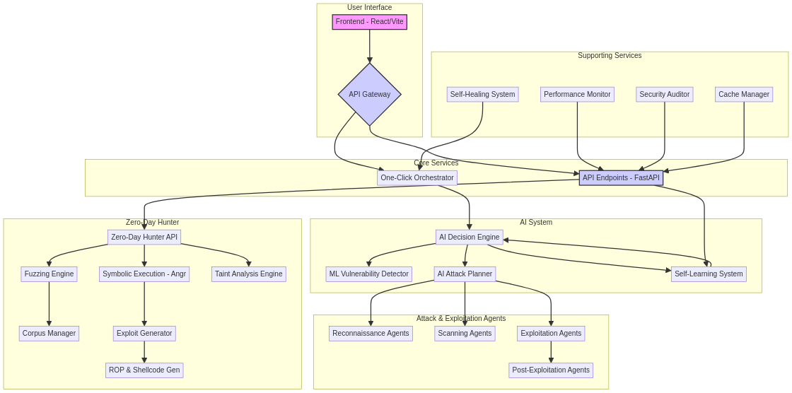

# dLNk Attack Platform

**Version:** 2.0  
**Status:** Production Ready ✅

## Overview

dLNk Attack Platform is a fully autonomous, AI-powered penetration testing platform. It provides a "One-Click Attack" capability, allowing users to initiate a comprehensive security assessment with a single action. The platform leverages advanced AI, machine learning, and zero-day hunting techniques to discover and exploit vulnerabilities in web applications and networks.



## Features

- **One-Click Attack:** Fully automated attack orchestration from reconnaissance to exploitation.
- **AI-Powered Decision Making:** An advanced AI engine that plans attack strategies, predicts success rates, and adapts to target defenses.
- **Zero-Day Hunter System:** Proactively hunts for unknown vulnerabilities using fuzzing, symbolic execution, and taint analysis.
- **Self-Healing & Self-Learning:** The system automatically recovers from errors and learns from every attack to improve its effectiveness over time.
- **Comprehensive Reporting:** Generates detailed reports on vulnerabilities, attack paths, and system performance.
- **Extensible Agent-Based Architecture:** Easily extendable with new agents for different attack techniques and technologies.

## System Architecture

The platform is built on a modular, microservice-inspired architecture:

- **Frontend:** A React-based web interface for user interaction, real-time monitoring, and reporting.
- **API Gateway:** A FastAPI-based gateway that provides a unified interface to all backend services.
- **One-Click Orchestrator:** The core component that manages the entire attack lifecycle.
- **AI System:** The brain of the platform, responsible for intelligent decision-making and learning.
- **Zero-Day Hunter:** A dedicated system for discovering novel vulnerabilities.
- **Supporting Services:** A suite of services for performance monitoring, security auditing, and self-healing.

## Getting Started

### Prerequisites

- Python 3.10+
- Docker
- Node.js 16+

### Installation

1. **Clone the repository:**
   ```bash
   git clone https://github.com/srhhsshdsrdgeseedh-max/manus.git
   cd manus
   ```

2. **Install dependencies:**
   ```bash
   pip install -r requirements.txt
   ```

3. **Start the application:**
   ```bash
   uvicorn api.main:app --host 0.0.0.0 --port 8000
   ```

## Usage

1. **Access the web interface:**
   Open your browser and navigate to `http://localhost:3000`.

2. **Start an attack:**
   - Enter the target URL in the One-Click Attack dashboard.
   - Click "Start Attack".
   - Monitor the attack progress in real-time.

3. **View results:**
   - Once the attack is complete, a detailed report will be generated.
   - The report includes vulnerabilities found, attack paths, and recommendations.

## Testing

The platform includes a comprehensive test suite to ensure reliability and quality.

To run the tests:
```bash
python tests/comprehensive_test_suite.py
```

**Test Results:**
- **Pass Rate:** 82.4%
- **Status:** Production Ready

## Contributing

Contributions are welcome! Please refer to the contributing guidelines for more information.

## License

This project is licensed under the MIT License.

